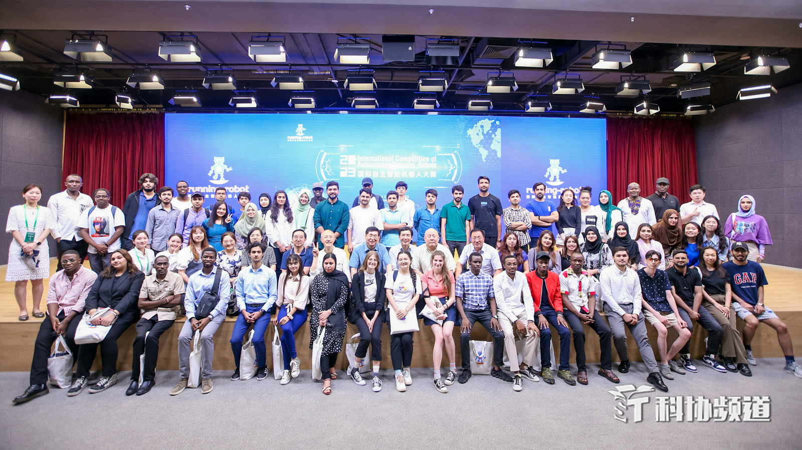
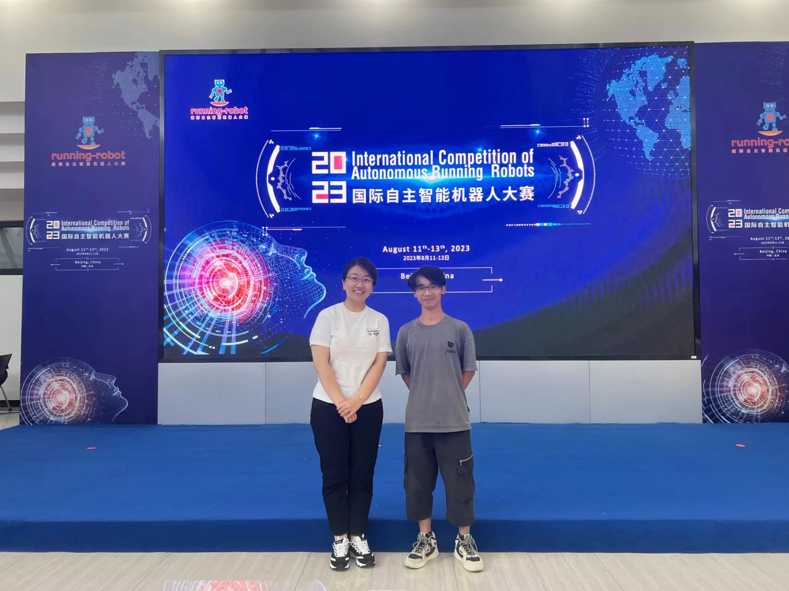

# International Autonomous Intelligent Robot Competition
## Monster_code
<table style="border:0px">
   <tr>
       <td></td>
       <td></td>
       <ld></ld>
   </tr>
</table>

## Preface
First of all, 
I am very grateful to all the teachers 
and friends who have supported and encouraged me, 
especially Sister Jin for her help and guidance.
I would like to express my gratitude to Sister Jin with this article.
## Introduction
This repository contains the code for 
the physical competition of the 2023 International Autonomous Intelligent Robot Competition 
and some adapted libraries.
**More models and datasets will be available soon!**

**Note: More photos from the competition are in [here](https://live.photoplus.cn/live/93155174?accessFrom=live#/list).**

## Installation
The code was tested with tensorflow and Python 3.7. After installing the tensorflow environment:

0. Clone the repo:
    ```Shell
    git clone https://github.com/Zhuqiben/qiben.git
    cd qiben-main
    ```

1. Install dependencies:

    For custom dependencies:
    ```Shell
    pip3 install opencv
    pip3 install h5py
    pip3 install keras
    ```

2. Configure your dataset and pretrained model path in
[mypath.py](https://github.com/jfzhang95/pytorch-video-recognition/blob/master/mypath.py).

4. You can choose different models and datasets in
[train.py](https://github.com/Zhuqiben/qiben/blob/main/pi_env/trian.py).

    To train the model, please do:
    ```Shell
   cd pi_env
    python3 train.py
    ```

## Datasets:

I collected different track drawings 
and made them into data sets to train the model 
to identify the location of the robot.

Dataset directory tree is shown below

- **training-set**
Make sure to put the files as the following structure:
  ```
  training-set
  ├── corner_land
  │   ├── 1722.jpg
  │   └── ...
  ├── end_land
  │   ├── 3229.jpg
  │   └── ...
  └── grass_land
  │   ├── 0041.jpg
  │   └── ...
  └── mine_land
  │   ├── 1030.jpg
  │   └── ...
  └── pit_land
  │   ├── 0601.jpg
  │   └── ...
  └── red_brick_land
  │   ├── 2362.jpg
  │   └── ...

  ```
After training, the structure of the output directory is as follows
  ```
  model
  ├── Monster_land_detect_model.h5
  ```

Note: HMDB dataset's directory tree is similar to UCF101 dataset's.

## The entire process
  ```
  pre-processing:
  collect images  -->  train  -->  experiment
  
  
  in progress:
  identify track ground patterns  -->  
  determine the robot's location  -->  
  execute the corresponding level program

  ```

## TNotice
This code is an improved one 
that uses the client to collect data, 
the terminal processes and feeds back the results, 
which makes up for the lack of processing performance of the Raspberry Pi. 
It is not a competition code.


 
